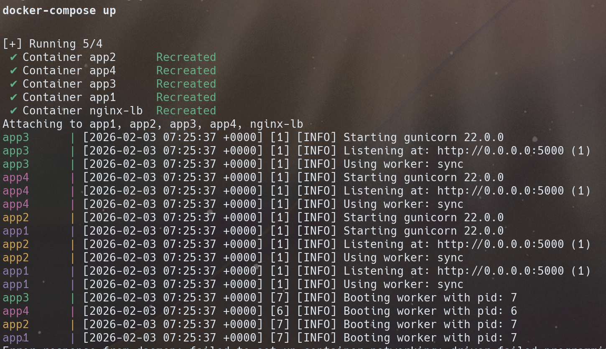

# Nginx Load Balancing (Flask + Gunicorn)

Simple example that runs multiple Flask app instances behind an Nginx load balancer.

Quickstart

- Build and start services (run from repository root):

```bash
docker compose up --build
```

- If you see an error like `unable to prepare context: path "/path/to/project/app" not found`, ensure the `build.context` path in `docker-compose.yml` points to an existing directory relative to the compose file (this repo uses `./app`).

Project layout

- `app/` - Flask application, `Dockerfile`, and `requirements.txt`.
- `nginx/` - Nginx configuration used for load balancing.
- `docker-compose.yml` - Compose file that defines 4 app replicas and an Nginx service.

CI

This repository includes a GitHub Actions workflow that:
- checks out the code
- sets up Python
- installs `app/requirements.txt`
- verifies Python syntax
- starts the app with Gunicorn and performs a `/healthz` request

See `.github/workflows/ci.yml` for details.

- Screenshots


Troubleshooting

- Make sure you run `docker compose` from the repository root so relative build paths resolve correctly.
- If you rename the `app` folder, update the `build.context` entries in `docker-compose.yml` accordingly.
